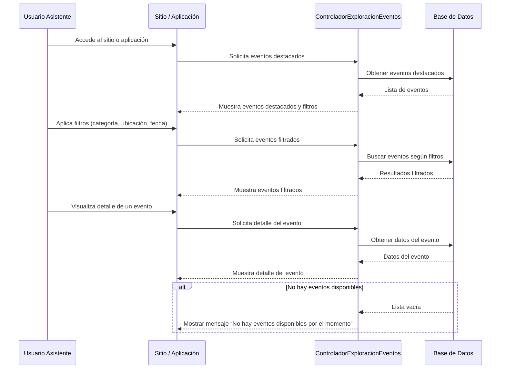

```mermaid
sequenceDiagram
    participant Usuario as Usuario
    participant UI as Interfaz (Sitio / App)
    participant Controlador as ControladorRegistro
    participant BD as Base de Datos

    %% Flujo principal
    Usuario->>UI: Clic en “Registrarse”
    UI->>Controlador: Mostrar formulario de registro
    Usuario->>UI: Completa campos obligatorios
    UI->>Controlador: Enviar datos del formulario
    Controlador->>BD: Validar datos
    alt Datos válidos
        Controlador->>BD: Crear nuevo usuario
        BD-->>Controlador: Confirmación de creación
        Controlador-->>UI: Mostrar mensaje de registro exitoso
    else Datos inválidos
        Controlador-->>UI: Mostrar mensaje de error
        Usuario->>UI: Corrige los campos
        UI->>Controlador: Reenvía datos
        Controlador->>BD: Validar datos nuevamente
        opt Datos ahora válidos
            Controlador->>BD: Crear nuevo usuario
            BD-->>Controlador: Confirmación de creación
            Controlador-->>UI: Mostrar mensaje de registro exitoso
        end
    end

    %% Alternativa: Usuario cancela el registro
    alt El usuario cierra el formulario
        Usuario->>UI: Cierra formulario de registro
        note over UI: Registro cancelado, fin del caso de uso
    end
